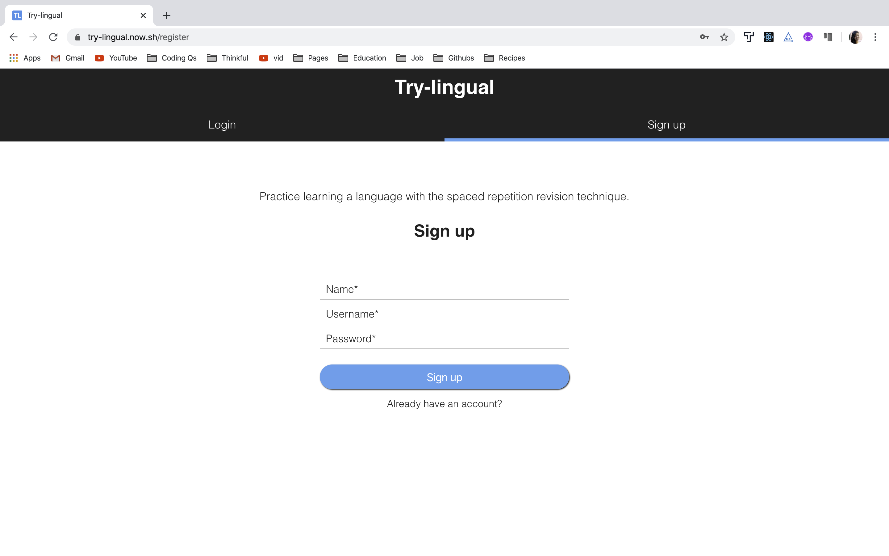
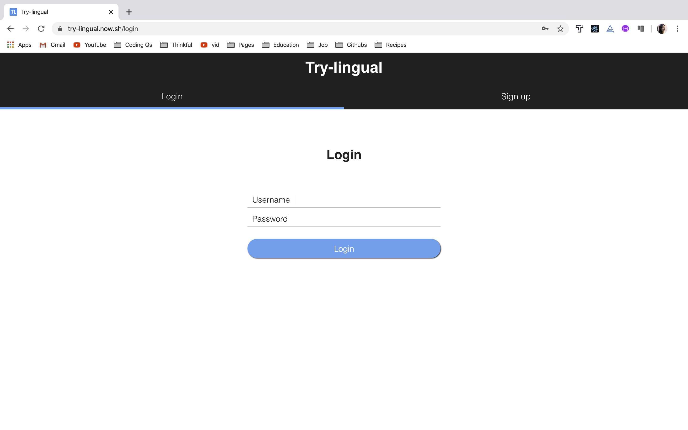
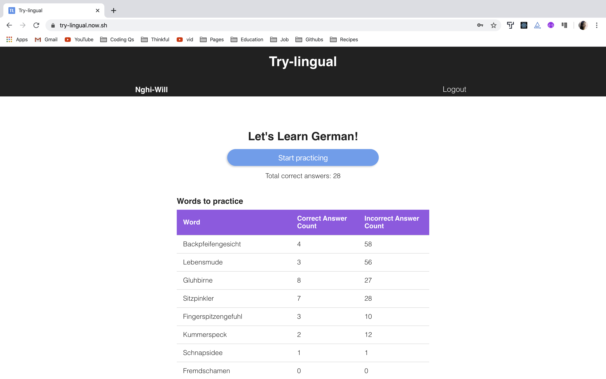
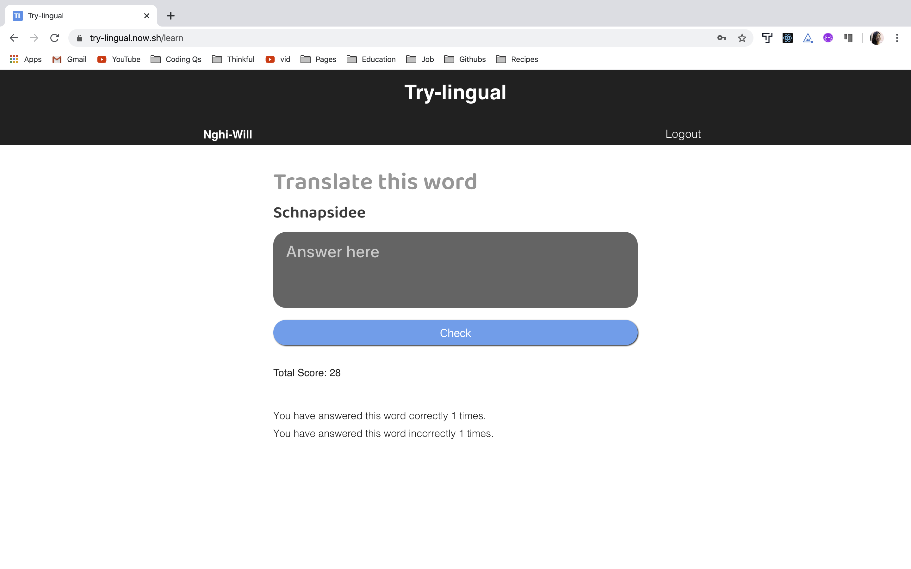
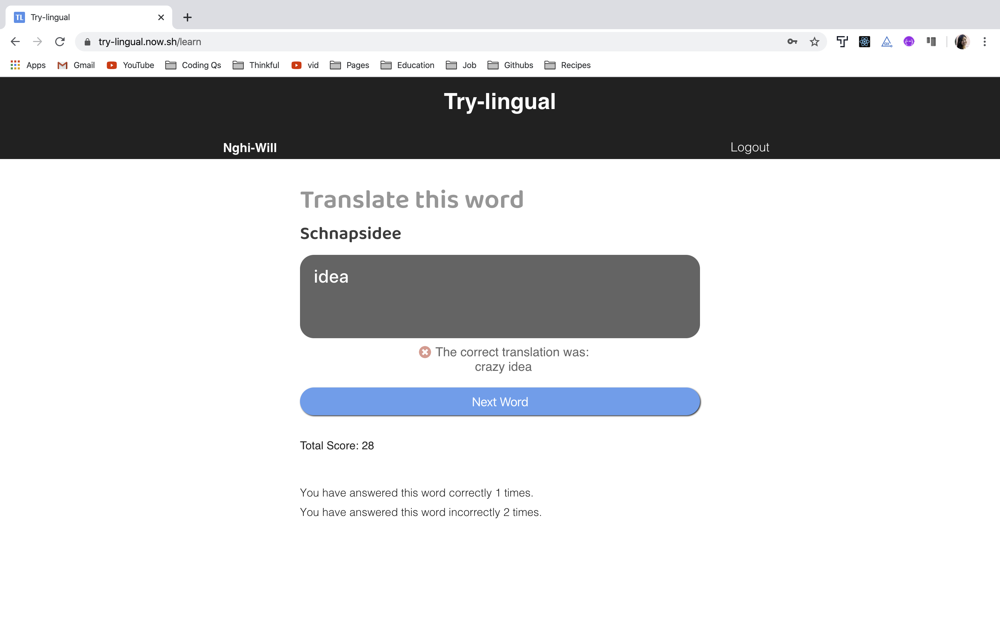
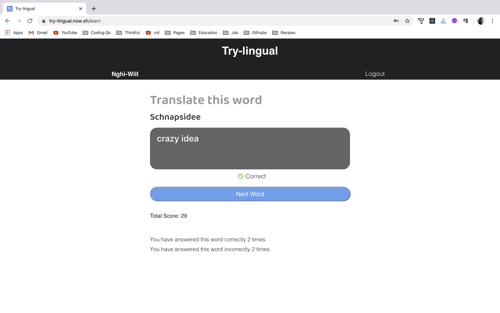

# Try-lingual

Try-lingual is a language learning app that allows users to learn foreign vocabulary with no english translation. Try-lingual uses spaced repetition learning technique to help users memorize the words forever.

Currently, the app only comes in German.

## Live App

https://try-lingual.now.sh/

## Authors

- Nghi Tran
- William MacNeil

## Tech Stack

- React
- Javascript
- HTML
- CSS
- Cypress

### API

- Server Repository: https://github.com/thinkful-ei-jaguar/German-Client-Nghi-Will
- Deployed Server: https://trylingual.herokuapp.com/api

### Screens

